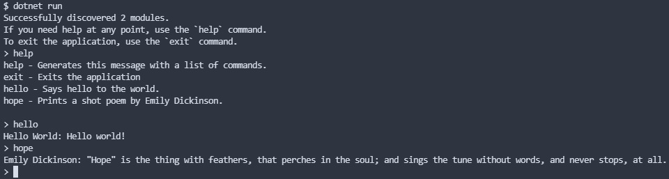

# 🌮 Taco's Sandbox 📦
Do you ever get tired of creating console app after console app just to test out ideas or concepts? Well, so do I! This sandbox utilizes reflection to enable a modularized approach to testing new ideas and concepts.

[](images/screenshot.jpg)

Welcome to my sandbox, wanna play?

## 👋 Hello World

Implementation is as simple as deriving a new `class` from `ConsumableModule`:

```cs
internal sealed class HelloWorld : ConsumableModule {
    public HelloWorld() : base("hello", "Hello World", "Says hello to the world.") { }
    public override void Invoke() => PostMessage("Hello world!");
}
```

Then simply use `dotnet run` to start the sandbox and enter the key for your module when prompted:

> Successfully discovered 1 module(s).<br/>
> If you need help at any point, use the `help` command.<br/>
> To exit the application, use the `exit` command.<br/>
> \> hello<br/>
> Hello World: Hello world!

## 🎨 Design Patterns
I've implemented plenty of design patterns in my carreer, but the one thing that always bothered me was a lack of demonstrations that related to junior or intermediate knowledge levels. As a result, I've intentionally implemented several design patterns with entry level use-cases.

- [Chain of Responsibility](../../tree/main/modules/personal/design-patterns/chain-of-responsibility) - Fizz Buzz
- [Mediator](../../tree/main/modules/personal/design-patterns/mediator) - Guessing Game

<sub>*If you have any questions regarding a design pattern implementation, feel free to ask a question in the [discussions area](https://github.com/tacosontitan/sandbox/discussions/categories/q-a).*</sub>

## 🔥 Interesting Implementations
Every now and then I stumble across a topic or problem that piques my interest to an extreme degree. When that happens, I like to break it down and try to understand it so that I can share it with others in an intelligent manner.

### Hamming Distance
The [Hamming distance](https://en.wikipedia.org/wiki/Hamming_distance) is the number of differences between two string-type inputs; or better explained by the aforelinked Wikipedia article:

> *In information theory, the Hamming distance between two strings of equal length is the number of positions at which the corresponding symbols are different.* <sub>[1]</sub>

For example:

> aaabaaa | abababa

In the example above there are *two* differences between the supplied inputs, so therefore the Hamming distance is 2. However, the use-case I found it through was actually working with integers instead of strings, yet its implementation was using string comparison which seemed rather, over the top. I was pretty sure it could be done with bitwise operations, and that led to an implementation [here](modules/personal//HammingDistance.cs) in my sandbox.

## ✒️ Citations
1. Wikipedia contributors. (2021, November 9). Hamming distance. In Wikipedia, The Free Encyclopedia. Retrieved 04:51, February 13, 2022, from https://en.wikipedia.org/w/index.php?title=Hamming_distance&oldid=1054348646