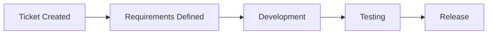

# Chapter 1

Chapter one covers an introduction to lean manufacturing and the "three ways"—the principals from which observed  DevOps
behaviors can be derived.

## Overview

The first chapter focuses on educating the reader about 

### Lead vs. Processing Time

## 🔍 Glossary

The following terms are emphasized in this chapter:

| Term                | Definition                                                                                                   |
|---------------------|--------------------------------------------------------------------------------------------------------------|
| `lead time`         | The amount of time between when a request is received and when processing of that request is complete.       |
| `process time`      | The amount of time between when work begins on a request and when the processing of the request is complete. |
| `flow velocity`     | The number of items that are completed in a set time period.                                                 |
| `flow efficiency`   | The proportion of items actively worked on to the total time elapsed.                                        |
| `flow time`         | A unit of business value pulled by a stakeholder through a product's value stream.                           |
| `flow load`         | The number of active or waiting items in a value stream.                                                     |
| `flow distribution` | The proportion of each item type in a value stream.                                                          |

Additionally, the following terms are discussed in more detail below:

- [Value Stream](#value-stream)

### Value Stream

A value stream is the process required to convert a business hypothesis into a technology-enabled service or feature
that delivers value to the customer; it is defined at a higher-level in the book as:

> *The sequence of activities an organization undertakes to deliver upon a customer request*
> 
> -or-
> 
> *The sequence of activities required to design, produce, and deliver a good or service to a customer, including the
> dual flows of information and material.*

In general, this can be envisioned from a developer's perspective with a simple high-level flow from ticket creation to
the release process:

